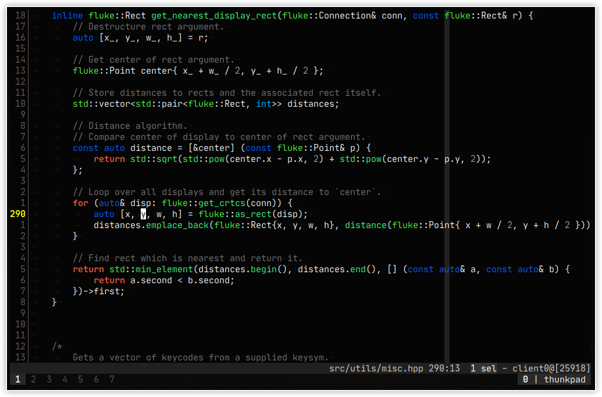
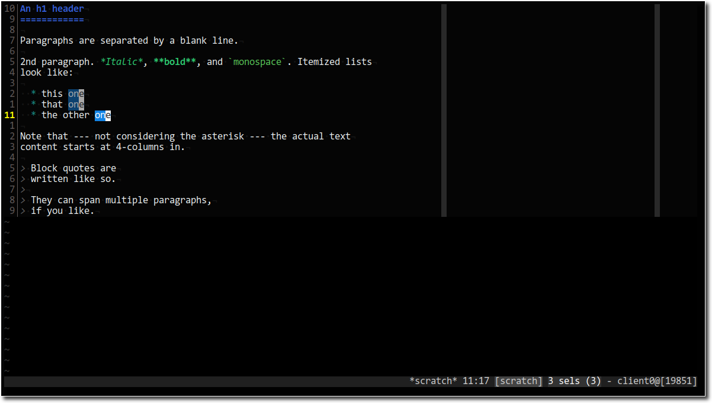

# ultrasonic
A colourscheme for kakoune.

### Screenshots

### Usage
Place the `ultrasonic.kak` in your `~/.config/kak/colours/` folder and then use the `:colorscheme ultrasonic` command.

### License
MIT
